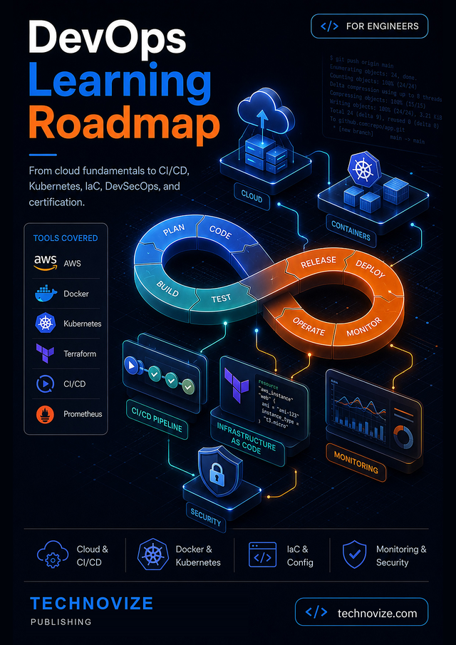

<div align="center">



# DevOps Roadmap — companion code for *DevOps Learning Roadmap*

**From Cloud Fundamentals to CI/CD, Kubernetes, IaC, DevSecOps, and Certification**
by **KC Ramo** · Technovize Publishing

[**Ebook (PDF + EPUB) →**](https://djangozen.com/ebooks/book/devops-learning-roadmap/) · [**Paperback →**](https://www.amazon.com/dp/9083782115)

546 pages · 8.25 × 11 inch · ISBN 978-90-8378-211-9

</div>

---

## About the book

DevOps is not a tool you can learn in a weekend. It spans the cloud, scripting,
configuration management, containers, delivery pipelines, infrastructure as code,
monitoring and security — and most engineers end up deep in one area with gaps
everywhere else.

*DevOps Learning Roadmap* is a structured path through all of it. Eleven hands-on
tutorials take you from a first cloud account to a portfolio and a certification
plan, each ending in lab exercises on free tiers, a ten-question quiz, a
troubleshooting guide and flashcards.

This repository holds the code. The reasoning is in the book.

## Companion code

Every code sample in the book lives here, organised one directory per tutorial.
389 files across 11 tutorials.

## Repository layout

| # | Directory | Tutorial | Files |
|---|---|---|---|
| 1 | [tutorial-01-cloud-fundamentals](tutorial-01-cloud-fundamentals/) | Cloud Computing Fundamentals for DevOps | 8 |
| 2 | [tutorial-02-programming-scripting](tutorial-02-programming-scripting/) | Programming & Scripting for DevOps | 43 |
| 3 | [tutorial-03-config-management](tutorial-03-config-management/) | Configuration Management with Ansible, Puppet & Chef | 42 |
| 4 | [tutorial-04-containers-kubernetes](tutorial-04-containers-kubernetes/) | Containerization & Orchestration with Docker & Kubernetes | 36 |
| 5 | [tutorial-05-cicd-pipelines](tutorial-05-cicd-pipelines/) | Building CI/CD Pipelines | 33 |
| 6 | [tutorial-06-iac-terraform](tutorial-06-iac-terraform/) | Infrastructure as Code with Terraform & CloudFormation | 41 |
| 7 | [tutorial-07-monitoring-observability](tutorial-07-monitoring-observability/) | Monitoring & Observability | 44 |
| 8 | [tutorial-08-devsecops](tutorial-08-devsecops/) | DevSecOps — Security & Compliance in DevOps | 51 |
| 9 | [tutorial-09-emerging-trends](tutorial-09-emerging-trends/) | Emerging Cloud DevOps Trends | 42 |
| 10 | [tutorial-10-portfolio-projects](tutorial-10-portfolio-projects/) | Building a DevOps Portfolio with Hands-On Projects | 26 |
| 11 | [tutorial-11-certifications](tutorial-11-certifications/) | DevOps Certifications — The 2026 Guide | 23 |

## Getting started

```bash
git clone https://github.com/technovize/devops-roadmap.git
cd devops-roadmap
```

The book sends readers to **technovize.com/code/devops-roadmap**, which redirects here. That address is the one in print, so it keeps working if this repository ever moves.

Then work from the directory for the tutorial you are reading. Each one has its own `README.md` listing what is inside.

## What you need

| Tool | From tutorial | Notes |
|---|---|---|
| Git | 2 | Configured with your name and email |
| Python 3.10+ | 2 | For the scripting examples |
| Docker | 4 | Docker Desktop or Docker Engine |
| kubectl + minikube/kind | 4 | Local Kubernetes for the labs |
| Terraform 1.6+ | 6 | Or OpenTofu |
| Ansible | 3 | `pip install ansible` |
| A cloud account | 1 | AWS, Azure, or GCP free tier |

## Cost safety

The labs are written against free tiers, but cloud billing is unforgiving of forgotten resources.

1. Tag everything you create with `project=devops-roadmap`.
2. Run `terraform destroy` / `kubectl delete` / delete the stack at the end of every session.
3. Set a billing alert at a low threshold on day one.

Load balancers, NAT gateways, and idle managed Kubernetes control planes are the usual sources of a surprise bill.

## About the scripts

Shell scripts here were extracted from the book's command listings. Where the book showed a command prompt followed by its output, the commands are live and the output lines are commented out. **Read a script before running it** — several create or destroy infrastructure.

## Errata

Tools move, services get renamed, and flags change. If something here has stopped working, open an issue or write to info@technovize.com. The current errata list lives in this README.

*No known errata at time of publication.*

## Licence

MIT — see [LICENSE](LICENSE). Use this code in your own projects, personal or commercial, without attribution.

The **book text, figures, and cover** are © 2026 KC Ramo / Technovize Publishing and are not covered by this licence.
